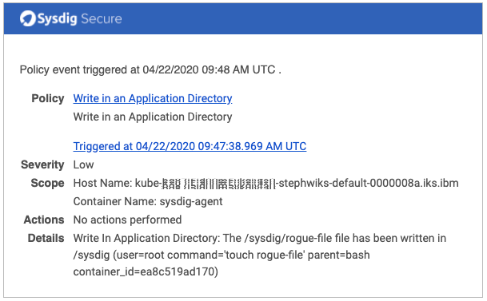

# SysdigAddOns / My Falco Rules

## What this is about

This directory contains the custom Falco rules I have created for customers. 

---

## **Rule**: Detect  writes in application's directories that are not written by the application itself

Useful if your application manipulates uploads and you want to be sure that nobody tries to inject rogue files...

### Configuration

- Customize the `application_binaries` macro with the list of binaries allowed to write in the directories
- Customize the `application_directories` macro with the list of directories you want to protect with the rule

### The Rule & Macros

[writeInAppDirectories.yaml](./writeInAppDirectories.yaml)

### Screenshot if the alert

---