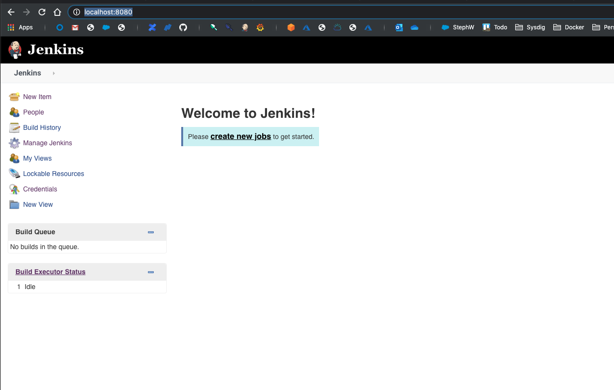
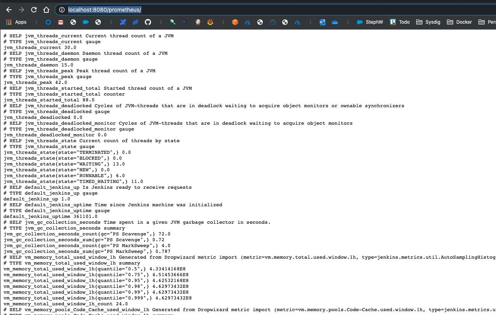

# SysdigAddOns / Jenkins Monitoring with Sysdig using Prometheus

## What this is about

Jenkins Prometheus Metrics


<br />

# Install jenkins using Helm for testing purpose

For testing purpose, you need to have Jenkins installed and configured. An easy way to do so is to use Helm. You will need to modify the Jenkins configuration before installation. We will use the Jenkins Helm chart located here: https://github.com/helm/charts/tree/master/stable/jenkins. To access this chart, add the **stable** Helm charts repo and check that you see Jenkins in the list:

```
helm repo add stable https://kubernetes-charts.storage.googleapis.com/
helm search repo stable
```
<br />

## Customize the Jenkins options before installation

Before installing the chart, we need to modify the Jenkins configuration, to add/modify a few things :

1) Add an executor to the Jenkins master en allow the master to execute pipelines
2) Add the Prometheus plugin to the list of Jenkins plugins to install.
3) Add pod annotations to allow the Sysdig Agent to detect the Jenkins Prometheus plugin
4) Deactivate persistence

In order to do these configuration change, you need to download the jenkins `values.yaml`config file from here: https://raw.githubusercontent.com/helm/charts/master/stable/jenkins/values.yaml. Modify its name to `jenkins-values.yaml` so that you cannot mismatch it with the values.yaml for the Sysdig Agent.

<br />

## Modifications

### 1) Search for `numExecutors` and modify that parameter to 1

### 2) Search for `installPlugins`and add the following line to the list: `- prometheus:2.0.6`

Note that version 2.0.6 may not be the latest version of the Prometheus plugin today, so check the latest version number here: https://plugins.jenkins.io/prometheus/

### 3) Search for `podAnnotations` and add the following 3 lines between the curly brackets:

```yaml
  prometheus.io/scrape: "true",
  prometheus.io/port: "8080",
  prometheus.io/path: "/prometheus"
```

### 4) Search for `persistence` and modify the `enabled` parameter one line below to `false`

If you prefer to get an already modified `values.yaml` file, you can download it from here: <<<>>>

### Install Jenkins

Simply create a new namespace named "jenkins" and then deploy in that namespace the Jenkins chart using the customized configuration file:

```
kubectl create ns jenkins
helm install jenkins -f jenkins-values.yaml stable/jenkins -n jenkins
```

### Validate and access Jenkins

- You should be able to validate that jenkins has correctly started using:

```
kubectl get all -n jenkins
```

- To get the Jenkins admin password:

```
printf $(kubectl get secret --namespace jenkins jenkins -o jsonpath="{.data.jenkins-admin-password}" | base64 --decode);echo
```

- To access Jenkins using kubectl port forwarding: 

```
kubectl port-forward service/jenkins 8080:8080 -n jenkins
```

Then using your favorite browser, navigate to:

 `http://localhost:8080`



- To validate the Jenkins Prometheus metrics, enable kubectl port forwarding as above and navigate to:

 `http://localhost:8080/prometheus`



---

## Install & Configure Sysdig Agent

We will use Helm as well to install and Configure the Sysdig Agent. For that you will need to:

1) Get your Sysdig Subscription Access Key
2) Download and modify the Helm configuration for the Sysdig agent
3) Install the Sysdig agent using the modifyed configuration

### 1) Get your Sysdig Access Key


kubectl edit configmap sysdig-agent -n sysdig-agent

- Config Prometheus:

```json
    prometheus:
      enabled: true
      ingest_raw: true
      ingest_calculated: false
    use_promscape: false
    10s_flush_enable: true
```


---

## Links

https://plugins.jenkins.io/prometheus/


https://sysdig.atlassian.net/wiki/spaces/~877077671/pages/865731144/Monitor+Jenkins+with+Prometheus

