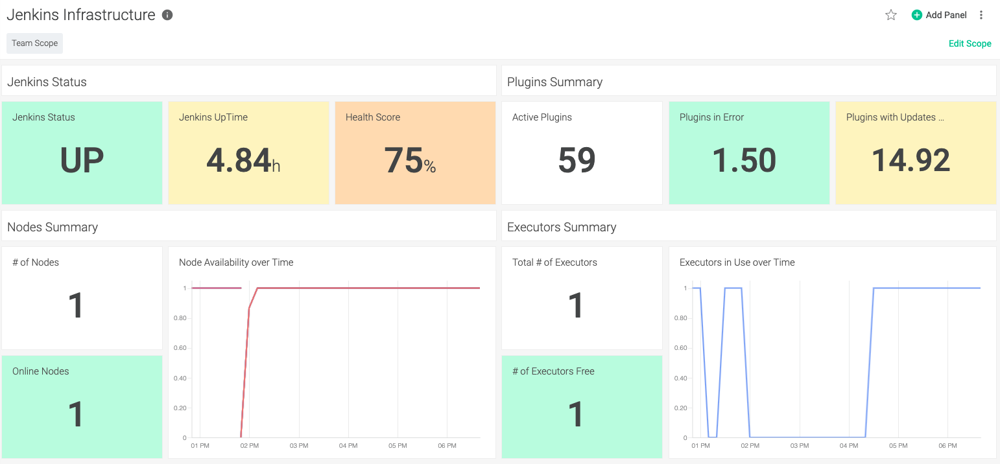

# SysdigAddOns / Jenkins Monitoring with Sysdig using Prometheus

## Overview

This article explores the Jenkins Prometheus metrics, and shows how to collect them with Sysdig Monitor, and create awesome Jenkins dashboards written in PromQL.

If you need to create a demo or test environment, the article starts with a step-by-step guide to create a demo environment, by installing and configuring Jenkins and the Sysdig agents on an existing Kubernetes cluster.

If you don't have Sysdig Monitor yet, you can start a 14 days free trial by registering here: https://sysdig.com/company/free-trial/

<br>

# 1) Install jenkins using Helm for testing purpose

For testing purpose, you need to have Jenkins installed and configured. An easy way to do so is to use Helm. You will need to modify the Jenkins configuration before installation. We will use the Jenkins Helm chart located here: https://github.com/helm/charts/tree/master/stable/jenkins. To access this chart, add the **stable** Helm charts repo and check that you see Jenkins in the list:

```
helm repo add stable https://kubernetes-charts.storage.googleapis.com/
helm search repo stable
```
<br>

## Customize the Jenkins options before installation

Before installing the chart, we need to modify the Jenkins configuration, to add/modify a few things :

1) Add an executor to the Jenkins master en allow the master to execute pipelines
2) Add the Prometheus plugin to the list of Jenkins plugins to install.
3) Add pod annotations to allow the Sysdig Agent to detect the Jenkins Prometheus plugin
4) Deactivate persistence

In order to do these configuration change, you need to download the jenkins `values.yaml`config file from here: https://raw.githubusercontent.com/helm/charts/master/stable/jenkins/values.yaml. Modify its name to `jenkins-values.yaml` so that you cannot mismatch it with the values.yaml for the Sysdig Agent.

<br>

## Modifications

### 1) Search for `numExecutors` and modify that parameter to 1

### 2) Search for `installPlugins`and add the following line to the list: `- prometheus:2.0.6`

Note that version 2.0.6 may not be the latest version of the Prometheus plugin today, so check the latest version number here: https://plugins.jenkins.io/prometheus/

### 3) Search for `podAnnotations` and add the following 3 lines between the curly brackets:

```yaml
  prometheus.io/scrape: "true",
  prometheus.io/port: "8080",
  prometheus.io/path: "/prometheus"
```

### 4) Search for `persistence` and modify the `enabled` parameter one line below to `false`

If you prefer to get an already modified `values.yaml` file, you can download it from here: https://raw.githubusercontent.com/swoillez/SysdigAddOns/master/Jenkins/jenkins-values.yaml


<br>

## Install Jenkins

Simply create a new namespace named "jenkins" and then deploy in that namespace the Jenkins chart using the customized configuration file:

```
kubectl create ns jenkins
helm install jenkins -f jenkins-values.yaml stable/jenkins -n jenkins
```

<br>

## Validate and access Jenkins

- You should be able to validate that jenkins has correctly started using:

```
kubectl get all -n jenkins
```

- To get the Jenkins admin password:

```
printf $(kubectl get secret --namespace jenkins jenkins -o jsonpath="{.data.jenkins-admin-password}" | base64 --decode);echo
```

- To access Jenkins using kubectl port forwarding: 

```
kubectl port-forward service/jenkins 8080:8080 -n jenkins
```

Then using your favorite browser, navigate to:

 `http://localhost:8080`


- To validate the Jenkins Prometheus metrics, enable kubectl port forwarding as above and navigate to:

 `http://localhost:8080/prometheus`


<br>


# 2) Install & Configure the Sysdig Agent

We will use Helm as well to install and Configure the Sysdig Agent. For that you will need to:

- Get your Sysdig Subscription Access Key
- Download and modify the Helm configuration for the Sysdig agent
- Install the Sysdig agent using the modifyed configuration

## Get your Sysdig Access Key

In the Sysdig console, go to `Settings/Agent Installation` and copy the Access Key:


## Customize the Sysdig agent options before installation

The helm chart for the Sysdig agent is located here: https://github.com/helm/charts/tree/master/stable/sysdig

Download the values.yaml file to modify it. It is here: https://raw.githubusercontent.com/helm/charts/master/stable/sysdig/values.yaml

### 1) Access Key

Search for `accessKey` and paste your Sysdig access Key

```yaml
  accessKey: "<Your Sysdig Access Key>"
```

### 2) Cluster Name

Search for `k8s_cluster_name` and paste the name of your cluster.

```yaml
  settings:
    k8s_cluster_name: "<Name of the Cluster>"
```

### 3) Activate Prometheus support

Just after the `k8s_cluster_name` line, paste in the following section:

```yaml
    prometheus:
      enabled: true
      ingest_raw: true
      ingest_calculated: false
    use_promscrape: false
    10s_flush_enable: true
```

If you prefer to get an already modified `values.yaml` file to install the Sysdig agents, you can download it from here: https://raw.githubusercontent.com/swoillez/SysdigAddOns/master/Jenkins/sysdig-values.yaml

<br>

## Install the Sysdig agents

Create a new namespace named "sysdig-agent" and then deploy in that namespace the Sysdig chart using the customized configuration file:

```
kubectl create ns jenkins
helm install sysdig -f sysdig-values.yaml stable/sysdig -n sysdig-agent
```

After a couple of minutes, you should see the agents showing up in your Sysdig console:


<br>

# 3) Create fake Jenkins failing pipelines for testing purpose

In order to generate interesting data to monitor, you need to execute Jenkins pipelines. If you don't have some already, here is a simple way to create a pipeline with lots of problems.

We will create a fake pipeline, that executes a script that will randomly cause fails and long running jobs.

In Jenkins, click on `New Item`, Give a name to your new pipeline, and select `Freestyle project`. Click OK.

In the Pipeline configuration window, find the `Build Triggers` section, check `Build Periodically` and, in the schedule window below, enter "`H/5 * * * *`". This will launch the Pipeline every 5 minutes.

Now find the `Build`section, click on `Add build step` and select `Execute Shell`. In the `Command`that appears below, copy and paste the following script. This will generate random fake errors and delays. You can modify the number `6` in the script. The lower the number is, the most probable an error will occur.

```bash
#!/bin/bash

echo "Jenkins Fake Bad Build task"

RANDOM_FAIL=$(($RANDOM%10))
RANDOM_LONG=$(($RANDOM%10))

echo "Random Fail number is: $RANDOM_FAIL"

if (( $RANDOM_FAIL > 6  )); then
  echo 'Fake Fail !!'
  exit 1
fi

echo "Random Long task number is: $RANDOM_LONG"

if (( $RANDOM_LONG > 6 )); then
  echo 'We will sleep for a bit long'
  sleep $(( ${RANDOM_LONG} + 15 ))
else
  echo 'This time the task is short'
  sleep ${RANDOM_LONG}
fi

exit 0
```

Save the pipeline. The first try will start quickly.

<br>

# 4) Create great Sysdig dashboards for Jenkins

Now that everything is set you should see Jenkins metrics in Sysdig and be able to create great looking dashboards for Jenkins.


Using these raw metrics, you can now create great Jenkins dashboards, using either PromQL panels or the Form based panels. The two can be mixed in the same dashboard, for your convenience.

### PromQL Panel:


### Form Based Panel:


## Sysdig Dashboards for Jenkins

You can explore the Prometheus metrics for Jenkins to find what is important for you and your users, and create the associated Sysdig dashboards.

As examples, I have create two Jenkins dashboards. The first one show the Jenkins infrastructure metrics, showing if the Jenkins environment works fine, and has enough resources to handle the load. The second dashboard is an example of a user oriented dashboard, that show detailed information of pipelines, in order to understand if everything runs well in the Jenkins environment.

### Jenkins Infrastructure Dashboard:



### Jenkins Pipelines Dashboard:


<br>

Of course, alerts can be created on all panels. For instance, you can be alerted if:

- Jenkins is down for more than 15 minutes
- More than 20% of Jenkins plugins need updates or are in error
- There are not enough resources to execute the pipelines
- Your pipeline is constantly failing for a couple of hours
- Your pipeline is now taking much more time than before to execute

<br>

## Import/Export Sysdig Dashboards

The easiest way to share dashboards in to import/export them using the `sdc-cli` command line. You can find the documentation for `sdc-cli` here: https://docs.sysdig.com/en/sysdig-cli-for-sysdig-monitor-and-secure.html

- To get the list of your dashboards:

```
sdc-cli dashboard list
```

- To export a dashboard:

```
sdc-cli --json dashboard get <dashboard ID> > <file.json>
```

- To import a dashboard:

```
sdc-cli dashboard add-json <file.json>
```

The two dashboards I have created above can be downloaded and then imported from here:

- Infra Dashboard: https://raw.githubusercontent.com/swoillez/SysdigAddOns/master/Jenkins/jenkins-infra.json
- Jobs Dashboard: https://raw.githubusercontent.com/swoillez/SysdigAddOns/master/Jenkins/jenkins-jobs.json
