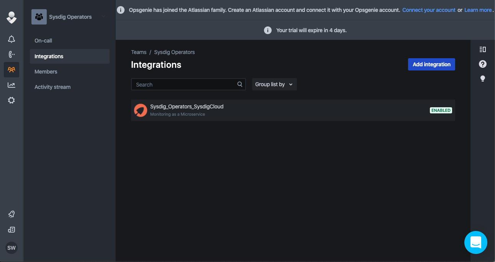
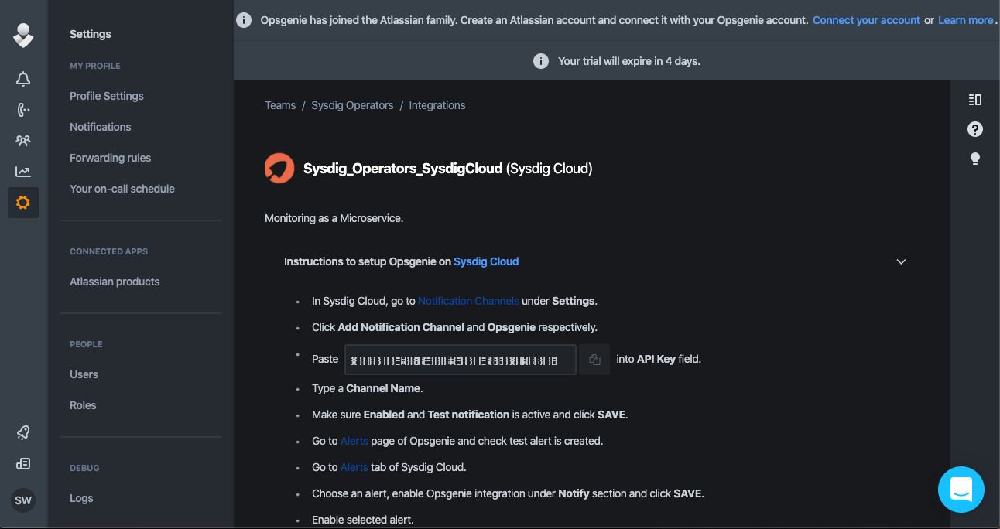
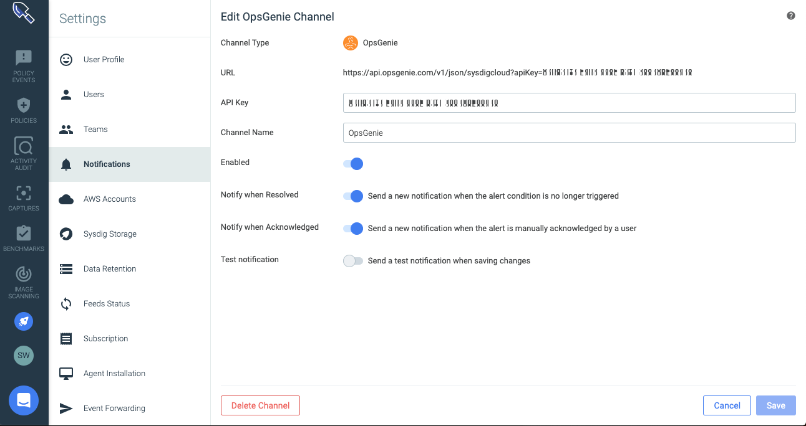
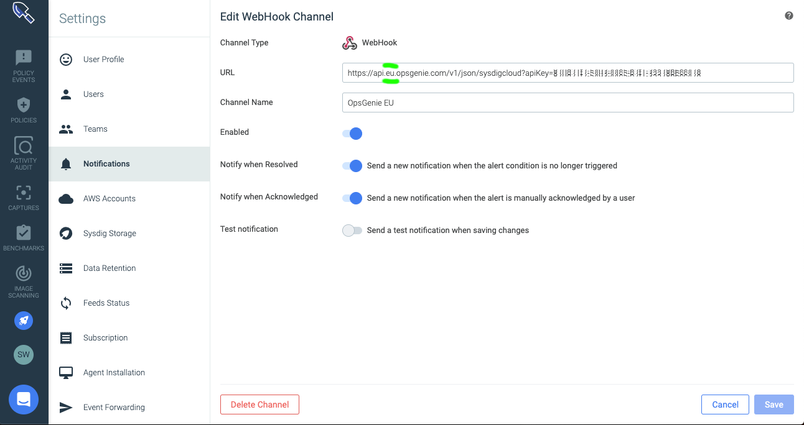
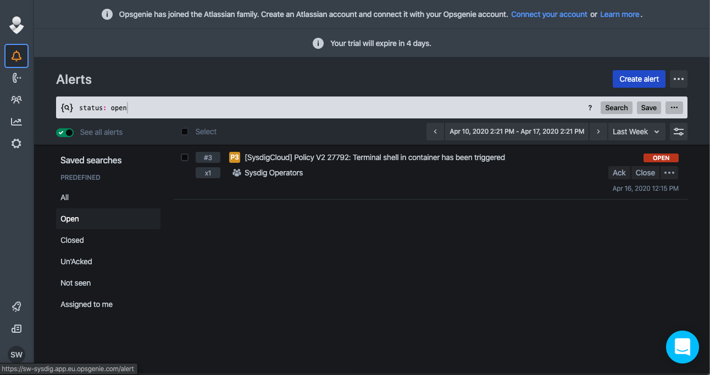
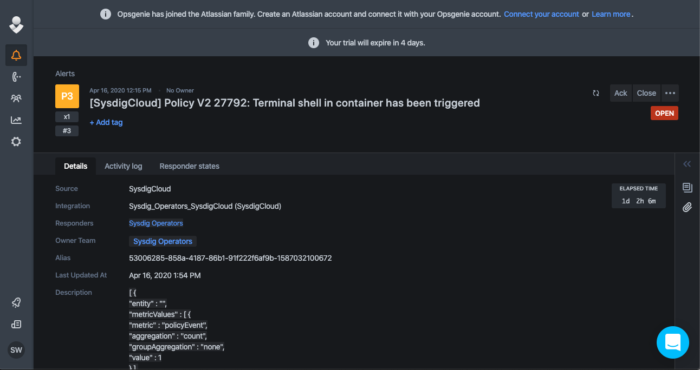

# SysdigAddOns / OpsGenie EU Endpoint

## What this is about

Sysdig supports the integration with OpsGenie as a notification channel. However, today sysdig uses the US endpoint of OpsGenie to send alerts.

OpsGenie has an EU endpoint as well. So if you use Sysdig on an European datacenter, from a performance point of view, it would be much more efficient to use this EU endpoint of OpsGenie.

Fortunately, there is a trick to do this :-)

## 4 Steps to trick Sysdig to use the EU endpoint of OpsGenie

- Step 1: In your OpsGenie EU instance, create a Sysdig integration

- Step 2: In the OpsGenie Sysdig integration configuration, copy your OpsGenie API Key

- Step 3: Then  go to Sysdig / Parameters / Notification Channel and create an OpsGenie endpoint. Fill in the details, your OpsGenie API key, a random name to your channel. Uncheck the "Test Notification" option because it won't work for sure at this point.

Save your channel, then reopen it immediately to copy the URL that for now points to the US OpsGenie endpoint.

- Step 4: **Here is the trick**: Create a new notification channel. This time create a channel of type **Webhook**. Paste the URL you just copied from the OpsGenie channel, but modify it slightly to add 'eu' in the server name. This should now be: api.eu.opsgenie.com like in the screenshot below. Give it the final real name. This time also, you can check the "Test Notification" option because it will work. Save your new channel.

Congrats !! You are all set.

- Extra Step: You can delete the first OpsGenie channel you have created. It won't be used.

## Sysdig Alerts in Opsgenie

In OpsGenie, you are now able to receive the alerts from Sysdig:

Note that, in OpsGenie, you can customize the mapping between the fields in a Sysdig alert, and the fields in an OpsGenie alert. That would give you more meaning inside OpsGenie.

