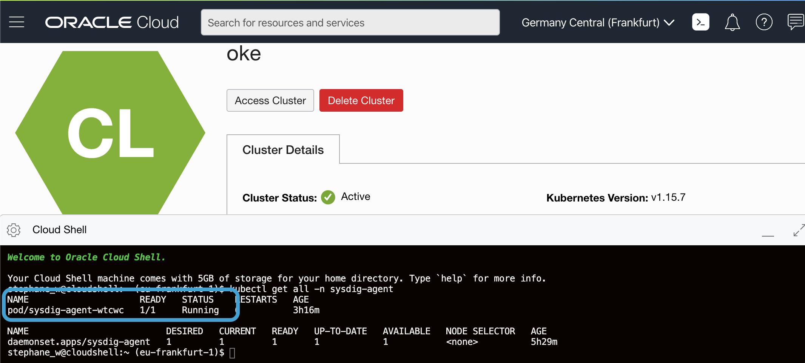
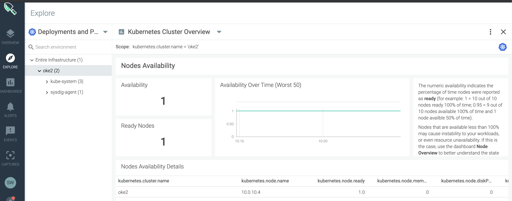
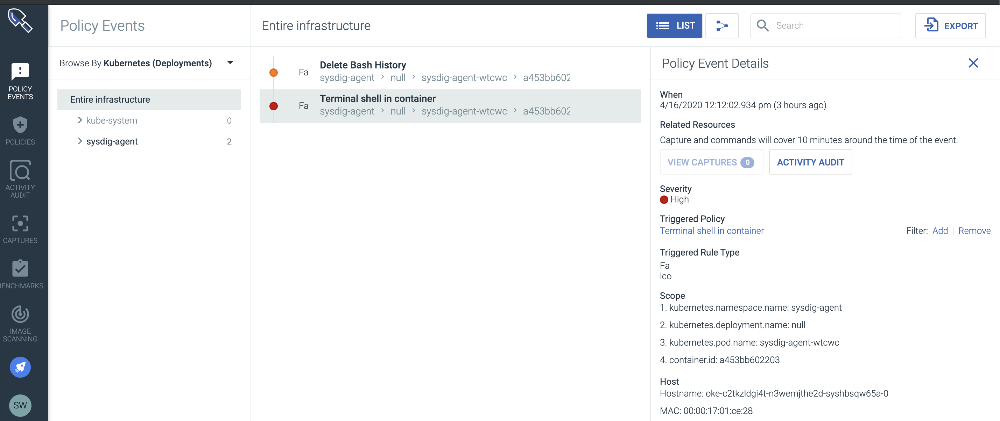

# SysdigAddOns / Oracle Kubernetes Engine

## Sysdig works with Oracle Kubernetes Engine (OKE) on Oracle Cloud

This page describes how to deploy the Sysdig agents on Oracle Kubernetes Engine.


    
## Things to know when deploying Sysdig agents on OKE

- Linux kernel headers are not installed by default on OKE nodes
- The Sysdig agents must be configured to use eBPF probe to work on OKE

## Install kernel headers on OKE nodes

Kernel headers are not installed by default on OKE nodes, and they are required by the Sysdig agent. So you need to install them using the following procedure:

1. You must have SSH access to the nodes. If not, delete your nodes pool and re create it with a SSH public key, so that you can SSH the nodes
2. SSH in the nodes
3. On each node, execute: `sudo yum -y install kernel-uek-devel-$(uname -r)`

## Sysdig agents deployment

- Follow the installation steps described here: https://docs.sysdig.com/en/steps-for-kubernetes--vanilla-.html **BUT:**

- Before executing step 7, modify the `sysdig-agent-daemonset-v2.yaml` to uncomment the follwing eBPF lines:

```shell
        #env:
        #  - name: SYSDIG_BPF_PROBE
        #    value: ""
```

- Then deploy the remaining steps and optional configuration

- And that's it. You are up and running.

## Some screenshots of Sysdig on OKE

- Sysdig Monitor



- Syssdig Secure


