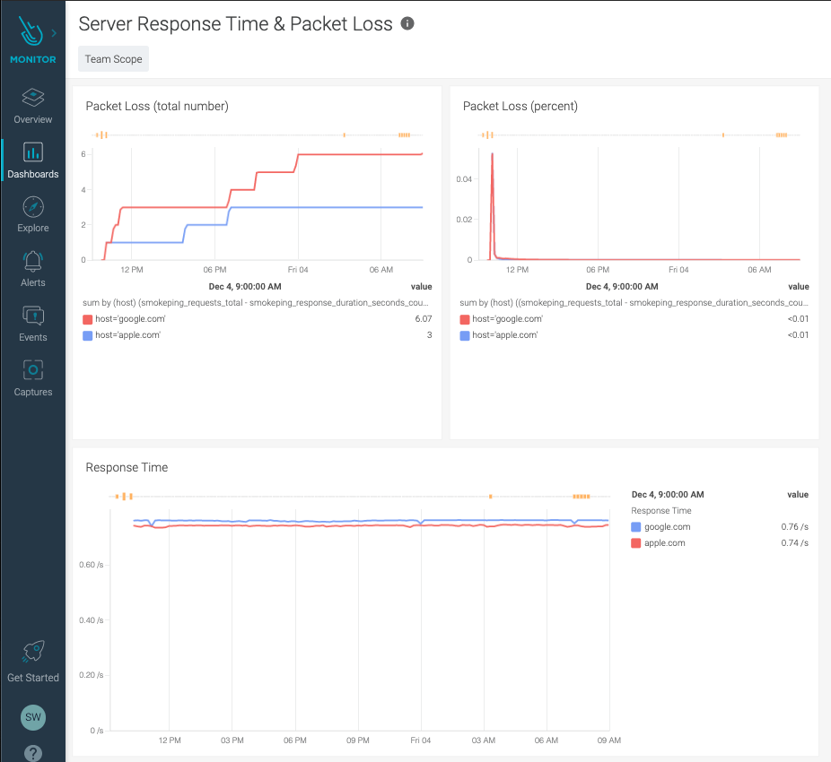
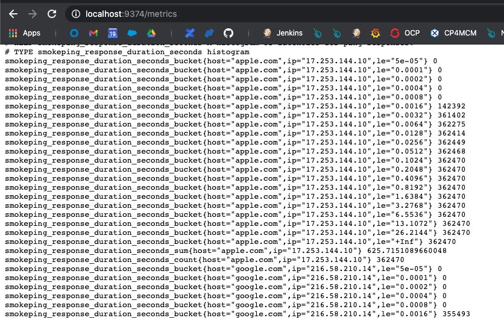
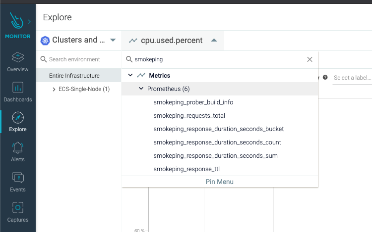

# SysdigAddOns / Monitoring Network Response Time and Packet Loss using a Prometheus Exporter

## Overview

How to measure packet loss ratio on selected network routes? <br>

This is the question that started this work. Fortunately, the Prometheus exporters capabilities are unlimited, and a quick google search allowed me to find an exporter capable of measuring ICMP response time, and a quick PromQL query allows easy calculation of packet loss percentage.

Here is an example dashboard that can be created using that technic:



<br>

## 1) How to deploy the Exporter

<br>

The exporter I use is located here: https://github.com/SuperQ/smokeping_prober/

If order to simplify the deployment, I have created a Docker Image https://hub.docker.com/repository/docker/stephw/smokeping_prober

If you prefer to build the image yourself, here is the Dockerfile: https://raw.githubusercontent.com/swoillez/SysdigAddOns/master/PromRespTimePacketLoss/Dockerfile

I have also created a Kubernetes Deployment to show how to configure and deploy the exporter: https://raw.githubusercontent.com/swoillez/SysdigAddOns/master/PromRespTimePacketLoss/k8s-deployment.yaml

You have to customize the list of servers to be monitored, by modifying the ```HOSTS``` variable in k8s-deployment.yaml file. To deploy the exporter, simply do:

```
kubectl create ns smokeping
kubectl deploy -n k8s-deployment.yaml -n smokeping
```

You can validate that the exporter works, by forwarding the metrics port using kubectl:

```
kubectl port-forward deployment.apps/smokeping 9374:9374 -n smokeping
```

Then open your browser and navigate to ```http://localhost:9374/metrics``` You should see something similar to this:




<br>

## 2) Access the metrics in Sysdig Monitor and create a dashboard

<br>

If your Sysdig agent is already configured to pull Prometheus metrics, then you have nothing to do. A few minutes after the start of the exporter, you should see your new metrics in the Sysdig Console.

To validate this, in the Sysdig Monitor console, go to ```Explore``` and search for ```smokeping```. You should see the smokeping metrics as shown below:



In order to get Packet Loss statictics, I used the instructions located here: https://serverfault.com/questions/985494/how-to-monitor-ping-packet-loss-via-prometheus-exporters

From these instructions, I created the simple dashboard showed at the top of this article. You can easily upload this dashboard to your subscription using the Sysdig command line interface, and the dashboard description I have provided here: https://raw.githubusercontent.com/swoillez/SysdigAddOns/master/PromRespTimePacketLoss/dashboard.json

To upload the dashboard, use the following command:

```
sdc-cli dashboard add-json dashboard.json
```

