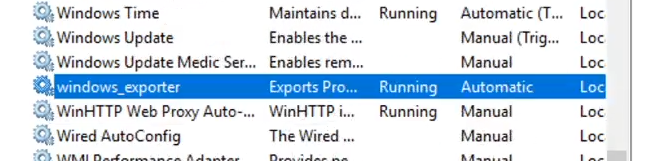
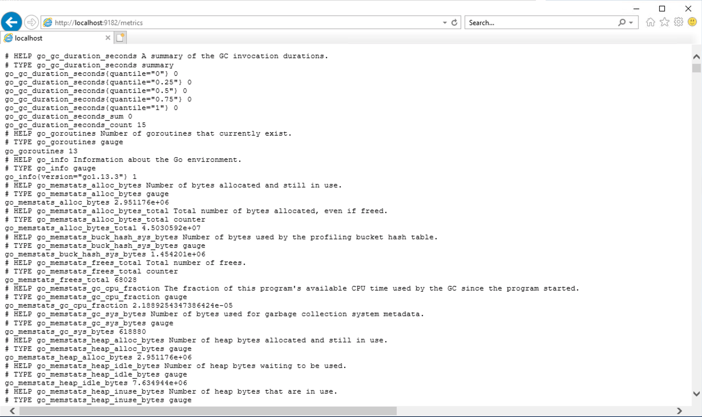
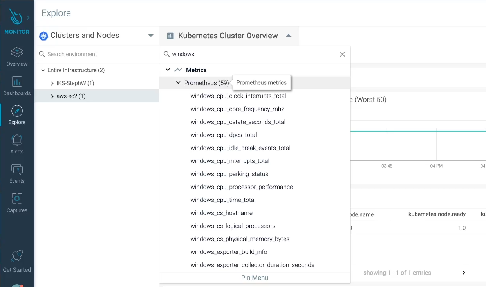
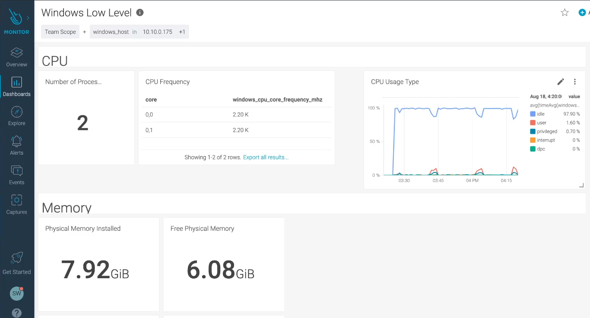

# SysdigAddOns / Windows Metrics Monitoring with Prometheus and Sysdig

## Overview

This article shows how to collect Windows Server metrics with Sysdig Monitor, using the Prometheus exporter for Windows Server

As there is no Sysdig agent for Windows, metrics are collected remotely. It is very simple to do so:

- On the Windows Server, metrics are exposed using a Prometheus exporter
- A Sysdig agent remotely scrapes the metrics from a Linux node
- The Sysdig agent sends the Windows metrics to the Sysdig backend where you can create dashboards and alerts for them

If you don't have Sysdig Monitor yet, you can start a 14 days free trial by registering here: https://sysdig.com/company/free-trial/

<br>

# 1) Install the Windows Server WMI exporter

The first thing to do is to install the Prometheus exporter on the Windows server. Instructions are located on the GitHub repo here: https://github.com/prometheus-community/windows_exporter

The exporter has many configuration options, and it exposes a lot of metrics. My advice is to carefully select the collectors you want to activate, in order to not generate too many metrics and use too much of CPU. By default, the exporter exposes the metrics on port `9182` in the `/metrics` path

If you don't need to customize the default behaviour, just launch the installer without any option. Once installed, you should see the exporter in the services list:



If you navigate to `"http://localhost:9182/metrics"` you should be able to see the Prometheus metrics:



<br>

# 2) Install and Configure the Sysdig agent for Prometheus remote scrapping

The Sysdig installation instructions are detailed in the article I have written for Jenkins. You can find the instructions [here](https://github.com/swoillez/SysdigAddOns/tree/master/Jenkins#2-install--configure-the-sysdig-agent)

<br>

The only thing that changes is the configuration of the agent. Following is a template that you can use to configure your agent

- You have to enable the Prometheus function of the agents
- The section of the agents configuration file related to remote scapping of the Windows metrics is `remote_service`
- The Sysdig agent does not really know that they are "windows" metrics, they are just remote Prometheus metrics
- Tags for the remote service are very important. They will give context to your metrics in the form of labels. This is where you can associate the metrics to the server name or IP address. Use tags wisely, remember that tags are Prometheus labels and labels create time series exponentially
- Note also that it is possible to limit the activation of the remote scrapper to a specific node or subset of nodes using annotation. If so, then you need to annotate a node to trigger the activation of the scrapper


```yaml
sysdig:
  accessKey: "<Your Sysdig Access Key>"
  settings:
    new_k8s: true
    tags:
      role: cluster
    k8s_cluster_name: "<Name of the Cluster>"
    use_promscrape: true
    10s_flush_enable: true
    snaplen: 512
    metrics_excess_log: true
    app_checks_enabled: false
    prometheus:
      enabled: true
      histograms: true
      ingest_raw: true
      ingest_calculated: false
      interval: 60
      timeout: 30
      log_errors: true
      max_metrics: 3000
      max_metrics_per_process: 20000
      remote_services:
        - wmi:
            kubernetes.node.annotation.sysdig.com/scraper: true
            conf:
              url: "http://<Windows Host IT address>:9182/metrics"
              tags:
                windows_host: "<Windows Host name or IP>"
                service: "windows_monitoring"
                scraping_node: "{kubernetes.node.name}"
                <Additionnal tags that you want to add to the metrics>
      process_filter:
        - include:
            kubernetes.pod.annotation.prometheus.io/scrape: true
          conf:
            path: "{kubernetes.pod.annotation.prometheus.io/path}"
            port: "{kubernetes.pod.annotation.prometheus.io/port}"
```

If you prefer to get an already modified `"values.yaml"` file to install the Sysdig agents, you can download it from here: https://raw.githubusercontent.com/swoillez/SysdigAddOns/master/WindowsMetrics/sysdig-values.yaml

<br>

# 3) Configure a node of your cluster for remote scrapping

If you have set a `"kubernetes.node.annotation.sysdig.com/scraper: true"` condition in the Sysdig agent configuration, then you need to annotate a node to allow the scrapper to run somewhere

```
kubectl annotate nodes <NODEID> sysdig.com/scraper=true
```

# 4) Create Sysdig dashboards for Windows Server

Now that everything is set, you should see Windows Server metrics in Sysdig



Using these raw metrics, you can create Windows dashboards, using either PromQL panels or the Form based panels. The two can be mixed in the same dashboard, for your convenience.



Note also that Prometheus labels allow you to select a specific Windows host (as on the screenshot above). You can also create dashboards that give values for a group of servers, or top 10 lists of servers

<br>

## Import/Export Sysdig Dashboards

The easiest way to share dashboards in to import/export them using the `sdc-cli` command line. You can find the documentation for `sdc-cli` here: https://docs.sysdig.com/en/sysdig-cli-for-sysdig-monitor-and-secure.html

- To get the list of your dashboards:

```
sdc-cli dashboard list
```

- To export a dashboard:

```
sdc-cli --json dashboard get <dashboard ID> > <file.json>
```

- To import a dashboard:

```
sdc-cli dashboard add-json <file.json>
```

As an example, the dashboard shown on the screenshot above is here: https://raw.githubusercontent.com/swoillez/SysdigAddOns/WindowsMetrics/windows-infra.json

<br>

# Links

[Windows Exporter on Sysdig Promcat.io](https://promcat.io/apps/windows)
<br>
[Windows Exporter GitHub Repository](https://github.com/prometheus-community/windows_exporter)
