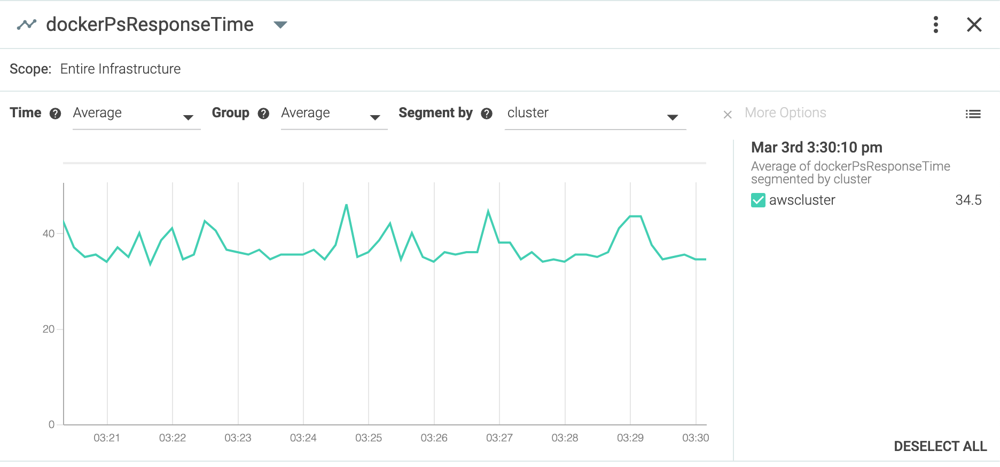

# SysdigAddOns / DockerPS Response Time Probe for Sysdig

## What is the DockerPS Response Time Probe for Sysdig ?

This is simple shell script that calls "docker ps", measures its response time, and generates a **_dockerPsResponseTime_** StatD metric with the provided labels.

The script works for both OpenSource docker engines / swarm clusters, and with Docker Enteprise that needs authentication.

The following screenshot shows how the metric appears in the Sysdig console:



## How it is built ?

This is a very simple loop that does "docker ps", pushes the result on the 8125 localhost UDP port, then goes to sleep until the next test.

There is no need to care about sending the data to the Sysdig agent (because of the StatD teleport function of the Sysdig agent)

The script is delivered in different forms:

- The simple shell script that you can use as-is
- A container that you have to build or get from the Docker Hub
- A Swarm service to ensure resiliance
- A Kubernetes Deployment for the same reason

## Parameters

Parameters are set using environment variables.

- **CLUSTER_NAME**: Name of the cluster to monitor (it will appear in Sysdig dashboards)
- **CHECK_INTERVAL**: Time in seconds between two checks
- **DOCKER_HOST**: Docker Open Source mode:  this is the URL with port to the Docker host
- **UCP_PUBLIC_FQDN**: Docker Enterprise mode: Address of the cluster in the form "https://<name or IP address>"
- **UCP_ADMIN_USERID**: Docker Enterprise mode: Name of a user able to execute "docker ps"
- **UCP_ADMIN_PASSWORD**: Docker Enterprise mode: The password of the user account above
- **METRIC_LABELS**: (optional) Comma-separated additional parameters. ex: region=europe, team=marketing
- **MILLISECONDS**: If set, gives the result in milliseconds, otherwise seconds

## How to configure encrypted remote access to a standalone Docker Host or Swarm Cluster

If the probe runs remotely from the cluster to test, then the target cluster must accept remote "docker cli" connections. It is enabled by default on Docker Enterprise, but it is not on standalone Docker hosts and Open Source Swarm clusters. Follow the following steps to enable encrypted remote access on them.

### Full configuration is here: https://docs.docker.com/engine/security/https/

### Simpler configuration

1. Copy the content of the [tlsdockerd](./tlsdockerd) directory to your docker host or swarm cluster manager

2. With admin privileges, execute [tlsdockerd/install-tls.sh](./tlsdockerd/install-tls.sh) to configure TLS on your server/cluster

3. You can test the TLS configuration using:

```
export DOCKER_HOST=tcp://<Server address>:2376
docker ps
```

## How to use the DockerPS Response Time Probe

### As a shell script

Simply export the required variables then execute the script:

```script
export CLUSTER_NAME="dockerCluster"
export CHECK_INTERVAL="10"
export DOCKER_HOST="tcp://192.168.59.103:2376"
export MILLISECONDS=""true"
./dockerPsResponseTime.sh
```
### As a container

1. You can use the already built image by doing: `docker pull stephw/dockerps-response-time`
2. You can build your own copy of the image: `docker build . -t dockerps-response-time`
3. Set the variables to be passed to the container as environment variables and launch `docker run` with your container.

An example is provided in [startProbe.sh](./startProbe.sh)

### As a Swarm service

Just use the [docker-compose.yaml](./docker-compose.yaml) file provided. You have to customise this file to update the parameters with your cluster details

1. On a single host:

`docker-compose up`

2. On a Swarm cluster:

`docker stack deploy -c docker-compose.yaml dockerpsprobe`

### As a Kubernetes deployment

Use the provided [k8s-deployment.yaml](./k8s-deployment.yaml) deployment file. You have to customise this file to update the parameters with your cluster details

Just do : `kubectl apply -f k8s_deployment.yaml -n <your namespace>`
