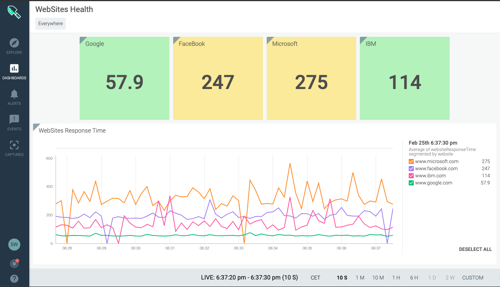

# SysdigAddOns / http Response Time Probe for Sysdig

## What is the http Reponse Time Probe for Sysdig ?

This is a small piece of code that allows you to monitor the response time of WebSites, by doing a simple HTTP request on the website and generate a StatD metric with according labels.

The Sysdig agent collects automatically this StatD metric, allowing the creation of dashboards like this:
    


## How it is built ?

This is a very simple loop that does an HTTP GET against the given URL, measures the time it takes to do it, pushes the result on the 8125 localhost UDP port, then goes to sleep until the next test.

There is no need to care about sending the data to the Sysdig agent (because of the StatD teleport function of the Sysdig agent)

The script is delivered in different forms:

- The simple python script that you can use as-is
- A container that you have to build or get from the Docker Hub. The provided startProbe.sh file shows how to build and start the container.
- A Kubernetes Deployment that ensures resilience. Have a look at it. This deployment actually starts 4 containers configured to test different websites. This is how the screenshot of this page has been built.

## Parameters

Parameters are set using environment variables.

- **WEBSITE_URL**: The URL or IP of the Web Site to test. It must have the form "https://<name or IP address>"
- **METRIC_NAME**: The name of the StatD metric
- **CHECK_INTERVAL**: Time in seconds between two checks
- **METRIC_LABELS**: (optional) Comma-separated additional parameters. ex: region=europe, team=marketing

## How to use the HTTP Response Time Probe

### As a Python script

Simply export the required variables then execute the python script:

```script
export WEBSITE_URL="http://www.sysdig.com"
export METRIC_NAME="websiteResponseTime"
export CHECK_INTERVAL=10
python httpResponseTime.py
```
### As a container

1. You can use the already built image by doing: `docker pull stephw/http-response-time`
2. You can build your own copy of the image: `docker build . -t http-response-time`
3. Set the variables to be passed to the container as environment variables and launch `docker run` with your container.

An example is provided in [startProbe.sh](./startProbe.sh)

### As a Kubernetes deployment

Use the provided [k8s-deployment.yaml](./k8s-deployment.yaml) deployment file. You have to customise this file to update the parameters with the web sites you want to test. The example start 4 containers to simultaneously test 4 web sites.

Just do : `kubectl apply -f k8s_deployment.yaml -n <your namespace>`
